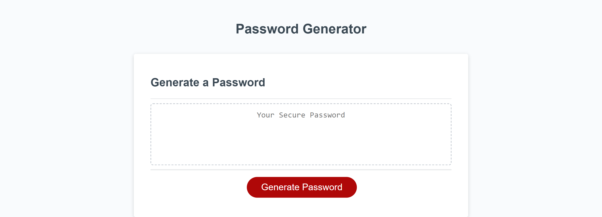
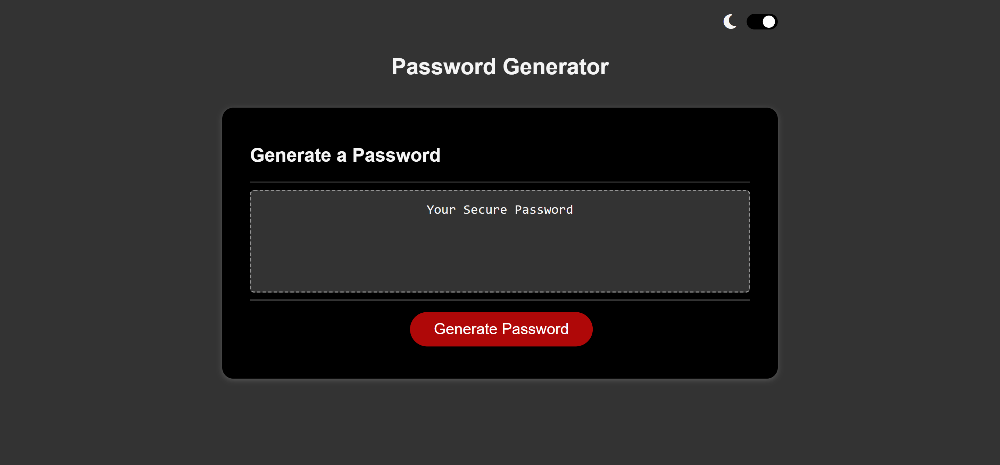
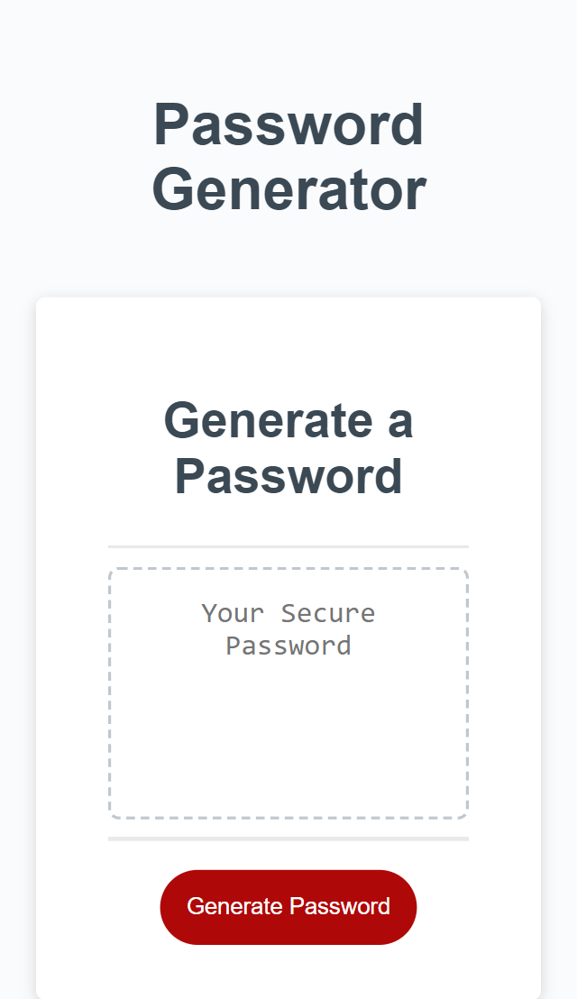

# Password Generator

An application that generates a random password based on users selected criteria.  
Also has a dark-mode which uses local storage to store users preference.

[**Deployed Project**](https://sebzg.github.io/Password-Generator/)

##

### Usage

#### Generate password

- Click the "Generate Password" button
- Input a valid length
- Choose from the given options - must choose at least 1
- Your password will appear on the page for you to copy.
- Clicking on the generated password will automatically selected all for copying.

#### Dark-Mode

- Simply click on dark-mode button and will toggle between dark and light mode
- Users preference is stored in local storage therefore will be remembered on next load/visit

##

### Resources

- [**W3 School**](https://www.w3schools.com/)
- [**MDN Web Docs**](https://developer.mozilla.org/)

##

### Desktop

##

### Dark-Mode

##

### Mobile

