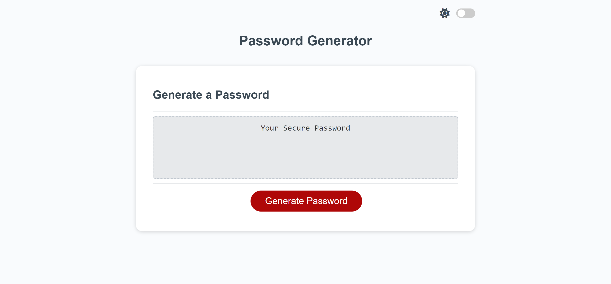
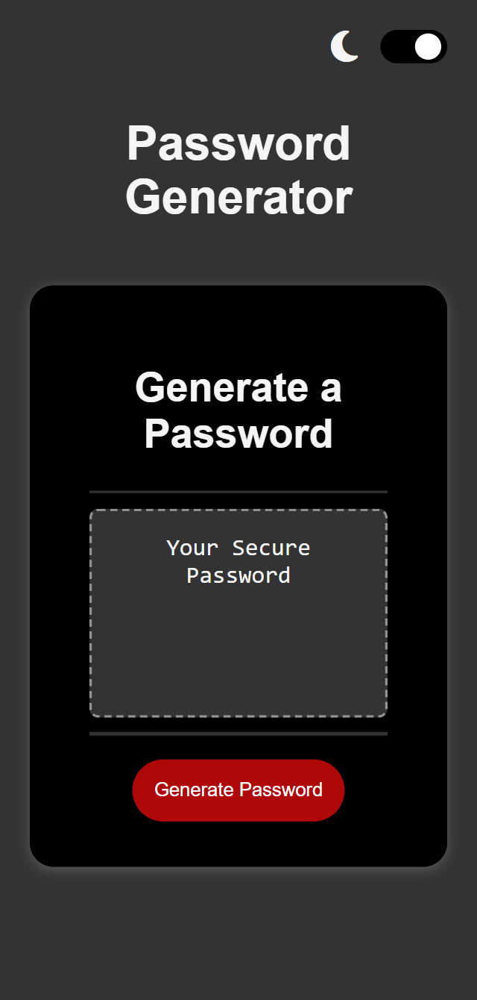

# Password Generator

An application that generates a random password based on users selected criteria.

[**Deployed Project**](https://sebzg.github.io/Password-Generator/)

##
### Usage

- Click the "Generate Password" button
- Input a valid length
- Choose from the given options - must choose at least 1
- Your password will apear on the page for you to copy.

##
### Resources
- [**W3 School**](https://www.w3schools.com/)
- [**MDN Web Docs**](https://developer.mozilla.org/)

##
### Desktop

##
### Mobile

